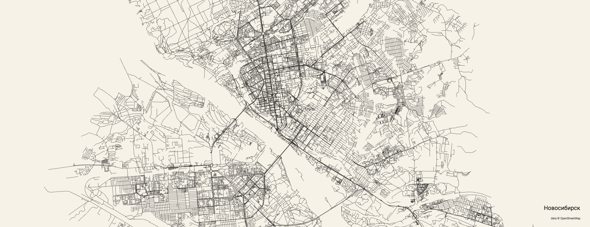

```{r applause-button, echo=FALSE}
applause::button(
  color = "#0C4047",
  width = "58px",
  multiclap = T
)
```

Для работы с географическими данными в языке программирования **R** существует большое количество различных библиотек. Хорошим источником по анализу, визуализации и моделированию геоданных может служить книга [Geocomputation with R](https://geocompr.robinlovelace.net/) или учебник [Визуализация и анализ географических данных на языке R](https://tsamsonov.github.io/r-geo-course/index.html). 

Замечательный сервис [city roads](https://anvaka.github.io/city-roads/) позволяет по названию города отобразить карты дорог из [OpenStreetMap](https://www.openstreetmap.org/) - свободно доступной базы данных всех местоположений в мире с открытой лицензией. 



Мы сделаем практически тоже самое, но дополнительно нанесем необходимые аналитические данные на карту.

Здесь будет рассмотрена работа с сервисом OpenStreetMap на примере библиотеки [osmdata](https://github.com/ropensci/osmdata), которая использует [Overpass API](https://wiki.openstreetmap.org/wiki/Overpass_API). Данные, которые мы будем обрабатывать и визуализировать, относятся к количеству пожаров в городе Новосибирске за последние несколько лет.

# Исходные данные по пожарам

Подключим небходимые библиотеки.

```{r setup, warning=FALSE, message=FALSE}

library(tidyverse)
library(magrittr)
library(RCurl)

library(osmdata)
```


Загрузим **данные по пожарам в Новосибирске**[^thanks], включающие период с 2016 года по 2020 год, предварительно удалив при этом строки, содержащие пропущенные данные. 

[^thanks]: Автор выражает благодарность [О.С. Малютину](https://www.sibpsa.ru/ntc/management/?ELEMENT_ID=748) за предоставленные данные.

{}

Отметим, что наши данные не охватывают полный объем значений по количеству пожаров, а только те данные, где удалось получить географические координаты по адресам пожаров и служат исключительно для иллюстрации рассматриваемых методов. Тем не менее, данные хорошо передают общую тенденцию и описываемые подходы обработки данных и их визуализации.

{}

```{r, warning=FALSE, message=FALSE}
url <- getURL("https://raw.githubusercontent.com/materov/blog_data/main/fire_NSK.csv")
fire <- read.csv(text = url)

fire %<>% na.omit()
fire %<>% as_tibble()
fire$DATE_ZVK %<>% as.Date()

fire
```

Для дальнейшего анализа оставим только значимые переменные в таблице:

- дату пожара;
- категорию объекта;
- географические координаты;
- время прибытия;
- площадь пожара.

```{r, warning=FALSE, message=FALSE}
fire <-
fire %>% 
  select(DATE_ZVK, 
         geo_lon, geo_lat,
         PRIB_TIME, SQUARE_LOC)

fire
```

Отметим неоднородность исходных данных, а именно, в последние два рассматриваемых года учитывалось гораздо больше пожаров, что видно из графика ниже.

```r
fire %>% 
  count(., DATE_ZVK) %>% 
  ggplot(aes(DATE_ZVK, n)) + geom_line() +
  labs(x = "дата",
       y = "количество пожаров")
```

```{r warning=FALSE, message=FALSE, echo=FALSE, fig.cap = "*Количество пожаров в сутки в г. Новосибирске (2016-2020 гг.)*", fig.height = 4, fig.width = 8}
fire %>% 
  count(., DATE_ZVK) %>% 
  ggplot(aes(DATE_ZVK, n)) + geom_line() +
  labs(x = "дата",
       y = "количество пожаров") + silgelib::theme_plex()
```

Дествительно, в 2019 и в 2020 годах на графике наблюдаются существенные всплески количества пожаров, что можно объяснить переходом на новую законодательную базу с 1 января 2019 года, при котром понятия *пожар* и *загорание* были совмещены. Для устранения неоднородности можно сделать фильтрацию данных, исключив такие объекты горения как мусор и траву, но мы этого делать не будем.

# Предварительная подготовка картографических данных

Сначала создадим карту дорог Новосибирска, а затем, используя билиотеку `ggplot2`, нанесем послойно на получившуюся карту информацию по пожарам.

На первом этапе, с помощью библиотеки `osmdata` загрузим данные из OpenStreetMap. Данные в базе OpenStreetMap хранятся в виде пар: **ключ** (**key**) и **значение** (**value**). Будем следовать той же идеологии как на странице [Streetmaps](https://ggplot2tutor.com/streetmaps/streetmaps/): загрузим данные по крупным улицам (streets), небольшим улицам (small_streets) и рекам (river). Все возможные значения любого ключа можно увидеть командой `available_tags()` (полные списки значений довольно большие), например

```{r, warning=FALSE, message=FALSE}
available_tags("highway") %>% head(., 10)
```

Данные из OpenStreetMap импортируются в координаты с помощью функции `get_bb()`, затем они фильтруются функцией  `add_osm_feature()` по необходимым геотегам и передаются на вывод функцией `osmdata_sf()` для последующей отрисовки в `ggplot2`.

```{r, warning=FALSE, message=FALSE}
# проспекты и большие улицы
streets <- getbb("Novosibirsk Russia") %>%
  opq()%>%
  add_osm_feature(key = "highway", 
                  value = c("motorway", "primary", 
                            "secondary", "tertiary")) %>%
  osmdata_sf()

# небольшие улицы
small_streets <- getbb("Novosibirsk Russia") %>%
  opq()%>%
  add_osm_feature(key = "highway", 
                  value = c("residential", "living_street",
                            "unclassified",
                            "service", "footway")) %>%
  osmdata_sf()

# реки
river <- getbb("Novosibirsk Russia") %>%
  opq() %>%
  add_osm_feature(key = "waterway", value = "river") %>%
  osmdata_sf()
```

# Отрисовка карт и нанесение информации по пожарам

Теперь мы готовы визуализировать карту дорог и рек Новосибирска.

```{r warning=FALSE, message=FALSE, fig.cap = "*OpenStreetMap карта города Новосибирска*", fig.height = 10, fig.width = 7}
ggplot() +
  # проспекты и большие улицы
  geom_sf(data = streets$osm_lines,
          inherit.aes = FALSE,
          color = "black",
          size = 0.4,
          alpha = 0.6) +
  # небольшие улицы
  geom_sf(data = small_streets$osm_lines,
          inherit.aes = FALSE,
          color = "black",
          size = 0.4,
          alpha = 0.4) +
  # реки
  geom_sf(data = river$osm_lines,
          inherit.aes = FALSE,
          color = "black",
          size = 0.2,
          alpha = 0.5) +
  # географические границы города Новосибирска
  coord_sf(xlim = c(82.7, 83.19), 
           ylim = c(54.77, 55.23),
           expand = FALSE) 
```


## Нанесение на карту данных по пожарам

Нанесем на карту точки, где произошли пожары в рассматриваемый период.

```{r warning=FALSE, message=FALSE, fig.cap = "*Визуализация пожаров (2016-2020 гг.) на карте города Новосибирска*", fig.height = 10, fig.width = 7}
# базовый график
ggplot() +
  geom_sf(data = streets$osm_lines,
          inherit.aes = FALSE,
          color = "white",
          size = 0.4,
          alpha = 0.8) +
  geom_sf(data = small_streets$osm_lines,
          inherit.aes = FALSE,
          color = "#ffbe7f",
          size = 0.2,
          alpha = 0.6) +
  geom_sf(data = river$osm_lines,
          inherit.aes = FALSE,
          color = "#7fc0ff",
          size = 0.2,
          alpha = 0.5) +
  coord_sf(xlim = c(82.62, 83.17), 
           ylim = c(54.73, 55.2),
           expand = FALSE) +
  # точки, где произошли пожары
  geom_point(data = fire, aes(geo_lon, geo_lat), 
             shape = 1, 
             stroke = 0.8,
             color = "#FC4E07", 
             alpha = 0.3) + 
  theme_void() +
  theme(
    plot.background = element_rect(fill = "#282828")
  )
```


## Плотность пожаров

На полученной карте видно, что наши данные по пожарам хорошо согласуются с данными OpenStreetMap. 

Теперь мы бы хотели получить представление о проблемных участках с максимальным количеством пожаров, однако наслоения точек на предыдущем рисунке не позволяют сделать качественные выводы. Визуально выделить участки с наибольшим количестовм пожаров можно двумя способами:

- испольовать непрерывный градиент (см., например [Kahle & Wikham](https://journal.r-project.org/archive/2013-1/kahle-wickham.pdf));
- разделить всю область значений на равные отрезки и использовать различную интенсивность цвета для каждого уровня.

Мы используем вторую возможность отрисовки участков количественно отделяющих пожары, используя `geom_density2d_filled()` и `geom_density2d()` для визуализации ядерной плотности. 

```{r warning=FALSE, message=FALSE, fig.cap = "*Плотность пожаров (2016-2020 гг.) на карте города Новосибирска*", fig.height = 10, fig.width = 7}
# базовый график
ggplot() +
  geom_sf(data = streets$osm_lines,
          inherit.aes = FALSE,
          color = "black",
          size = 0.4,
          alpha = 0.8) +
  geom_sf(data = small_streets$osm_lines,
          inherit.aes = FALSE,
          color = "black",
          size = 0.4,
          alpha = 0.8) +
  geom_sf(data = river$osm_lines,
          inherit.aes = FALSE,
          color = "#7fc0ff",
          size = 0.2,
          alpha = 0.6) +
  coord_sf(xlim = c(82.62, 83.17), 
           ylim = c(54.73, 55.2),
           expand = FALSE) +
  # градиент
  geom_density2d_filled(data = fire, aes(geo_lon, geo_lat), 
             alpha = 0.7) +
  # линии уровня
  geom_density2d(data = fire, aes(geo_lon, geo_lat), 
             color = "black", alpha = 0.8) +
  # цвет
  scale_fill_brewer() +
  labs(fill = "количество пожаров:") + 
  theme_void() +
  theme(legend.position = "top")  
```

## Нанесение на карту данных по времени прибытия

Рассмотрим на карте данные по прибытию подразделений :fire_engine: , выделив только те события, где время прибытия составило более 10 минут.

```{r, warning=FALSE, message=FALSE}

# https://cran.r-project.org/web/packages/janitor/vignettes/tabyls.html
fire %>% 
  mutate(
    late_category = case_when(
      PRIB_TIME > 10 ~ "> 10 мин",
      TRUE ~ "<= 10 мин"
    )
  ) %>%
  janitor::tabyl(late_category) %>%
  janitor::adorn_pct_formatting(digits = 1) %>% 
  purrr::set_names("категория", "количество", "процент")
```

Как видно из таблицы выше, процент событий с временем прибытия более 10 минут довольно мал по сравнению с общим количеством пожаров. 
Нанесем на карту точки с долгим временем прибытия и дислокации пожарных частей города Новосибирска.

```{r, warning=FALSE, message=FALSE}
fire_late_points <- fire %>% 
  filter(PRIB_TIME > 10) %>% 
  select(geo_lon, geo_lat)
```

*Координаты некоторых основных пожарных частей г. Новосибирска*

```{r, warning=FALSE, message=FALSE}
fire_stations <-
  tribble(
    ~name, ~geo_lon, ~geo_lat,
    "СПСЧ", 82.97908757779791, 55.10638825,
    "СПСЧ-3", 83.178200, 54.937824,
    "ПСЧ-1", 82.93324274637051, 55.0254707,
    "ПСЧ-2", 82.9184471, 55.0422414,
    "ПСЧ-3", 82.95710502339779, 55.010753449999996,
    "ПСЧ-4", 82.97564223619477, 55.05086455,
    "ПСЧ-5", 82.89667373263423, 55.05429615,
    "ПСЧ-6", 82.84037900000001, 54.99433685,
    "ПСЧ-7", 83.09816122044344, 54.9741693,
    "ПСЧ-8", 83.099370, 54.858548,
    "ПСЧ-9", 82.900372, 54.958476,
    "ПСЧ-10", 82.96720840392814, 55.1805103,
    "ПСЧ-11", 83.128238, 54.744382,
    "ПСЧ-15", 82.79992967036416, 54.996677250000005,
    "ПСЧ-15 пост", 82.859950, 55.027657,    
    "ПСЧ-19", 82.98182030377154, 55.0763039,
    "ПСЧ-24", 82.97588842389447, 54.863162349999996,
    "ПСЧ-27", 82.988649, 55.064143,
    "ПСЧ-32", 83.051309, 54.740612,
    "ПСЧ-37", 82.996118, 54.927500,
    "ПСЧ-46", 82.7214455809438, 54.9883955
)
```


```{r warning=FALSE, message=FALSE, fig.cap = "*Данные по времени прибытия пожарно-спасательных подразделений > 10 мин. на пожары (2016-2020 гг.) на карте города Новосибирска*", fig.height = 10, fig.width = 7}

require(ggrepel)

# базовый график
ggplot() +
  geom_sf(data = streets$osm_lines,
          inherit.aes = FALSE,
          color = "black",
          size = 0.4,
          alpha = 0.4) +
  geom_sf(data = small_streets$osm_lines,
          inherit.aes = FALSE,
          color = "black",
          size = 0.4,
          alpha = 0.3) +
  geom_sf(data = river$osm_lines,
          inherit.aes = FALSE,
          color = "#7fc0ff",
          size = 0.2,
          alpha = 0.6) +
  coord_sf(xlim = c(82.62, 83.17), 
           ylim = c(54.73, 55.2),
           expand = FALSE) +
  theme_void() +
  # точки с долгим временем прибытия
  geom_point(data = fire_late_points, aes(geo_lon, geo_lat), 
             color = "firebrick2", alpha = 0.7) + 
  # пожарные части
  geom_point(data = fire_stations, aes(geo_lon, geo_lat), 
             color = "blue", alpha = 1, shape = 8, size = 2.5, stroke = 1) +  
  # названия пожарных частей
  geom_label_repel(data = fire_stations, aes(geo_lon, geo_lat, label = name), 
             size = 3, alpha = 0.9)
```

Увеличив фрагмент карты, можно видеть какие районы являются проблемными для их достижения.

```{r warning=FALSE, message=FALSE, echo=FALSE, fig.cap = "*Фрагмент данных, иллюстрирующих труднодостижимые районы прибытия пожарно-спасательных подразделений города Новосибирска*", fig.height = 4, fig.width = 8}

#, fig.height = 4, fig.width = 6}

require(ggrepel)

# базовый график
ggplot() +
  geom_sf(data = streets$osm_lines,
          inherit.aes = FALSE,
          color = "black",
          size = 0.4,
          alpha = 0.4) +
  geom_sf(data = small_streets$osm_lines,
          inherit.aes = FALSE,
          color = "black",
          size = 0.4,
          alpha = 0.3) +
  geom_sf(data = river$osm_lines,
          inherit.aes = FALSE,
          color = "#7fc0ff",
          size = 0.2,
          alpha = 0.6) +
  coord_sf(xlim = c(82.8, 83.17), 
           ylim = c(54.9, 55.0),
           expand = FALSE) +
  theme_void() +
  # точки с долгим временем прибытия
  geom_point(data = fire_late_points, aes(geo_lon, geo_lat), 
             color = "firebrick2", alpha = 0.7, size = 2.2) + 
  # пожарные части
  geom_point(data = fire_stations, aes(geo_lon, geo_lat), 
             color = "blue", alpha = 0.9, shape = 8, size = 3.2, stroke = 1) +  
  # названия пожарных частей
  geom_label_repel(data = fire_stations, aes(geo_lon, geo_lat, label = name), 
             size = 3, alpha = 0.9)
```

## Визуализация пожаров по площадям

В конце статьи проведем мини-исследование по площадям пожаров. Проверим следующую гипотезу: **наиболее крупные пожары происходили на окраинах города**.

Для отображения больших значений, таких как площади в нашем случае, удобно рассмотреть вместо значения величины ее десятичный логарифм.
Здесь же отфильтруем данные, оставив только те пожары, площадь которых составила более 1 000 кв. м.

```{r, warning=FALSE, message=FALSE}
fire_square <- fire %>% 
  filter(SQUARE_LOC > 0) %>% 
  select(geo_lon, geo_lat, SQUARE_LOC) %>% 
  mutate(log_square = log10(SQUARE_LOC)) 

fire_square <- fire_square %>% filter(log_square >= 3)
```

Сделаем разбивку пожаров по соответствующим категориям.

```{r, warning=FALSE, message=FALSE}
fire_square <-
fire_square %>% 
  mutate(
    size_category = case_when(
      log_square >= 1 & log_square < 2 ~ "> 10 кв. м",
      log_square >= 2 & log_square < 3 ~ "> 100 кв. м",
      log_square >= 3 & log_square < 4 ~ "> 1 000 кв. м",
      log_square >= 4 & log_square < 5 ~ "> 10 000 кв. м",
      log_square >= 5 & log_square < 100 ~ "> 100 000 кв. м",
      TRUE ~ "<= 10 кв. м"
    )
  ) %>% 
  mutate(size_category = factor(size_category, 
                                levels = c("> 10 кв. м", 
                                           "> 100 кв. м", 
                                           "> 1 000 кв. м", 
                                           "> 10 000 кв. м", 
                                           "> 100 000 кв. м")))
```

Отобразим пожары с учетом их площадей чтобы проверить, насколько верна наша гипотеза.

```{r warning=FALSE, message=FALSE, fig.cap = "*Пожары в г. Новосибирске (2016-2020 гг.) с площадью > 1 000 кв. м*", fig.height = 10, fig.width = 7}
# базовый график
ggplot() +
  geom_sf(data = streets$osm_lines,
          inherit.aes = FALSE,
          color = "black",
          size = 0.4,
          alpha = 0.4) +
  geom_sf(data = small_streets$osm_lines,
          inherit.aes = FALSE,
          color = "black",
          size = 0.4,
          alpha = 0.3) +
  geom_sf(data = river$osm_lines,
          inherit.aes = FALSE,
          color = "#7fc0ff",
          size = 0.5,
          alpha = 0.8) +
  coord_sf(xlim = c(82.68, 83.19), 
           ylim = c(54.77, 55.23),
           expand = FALSE) +
  theme_void() +
  # площади пожаров
  geom_point(data = fire_square, aes(geo_lon, geo_lat, 
                                     color = size_category,
                                     size = size_category), 
             alpha = 0.7, stroke = 2) +
  scale_color_brewer(palette = "Reds") +
  labs(size = "площадь пожара:", color = "")
```

Как показывет предыдущий рисунок, действительно, наиболее крупные по площади пожары происходили на окраинах города.

# Заключение

В статье были рассмотрены простейшие возможности языка программирования **R** в применении к анализу географических данных по пожарам и их последствиям. Были рассмотрены нанесение на карту:

- исходных данных по пожарам;
- плотности пожаров;
- данных по времени прибытия подразделений;
- площадей пожаров.

Используемые аналитические инструменты и сделанные выводы могут быть полезны при планировании и оптимизации ресурсов пожарно-спасательных подразделений, а также при рассмотрении чрезвычайных ситуаций иного рода.


